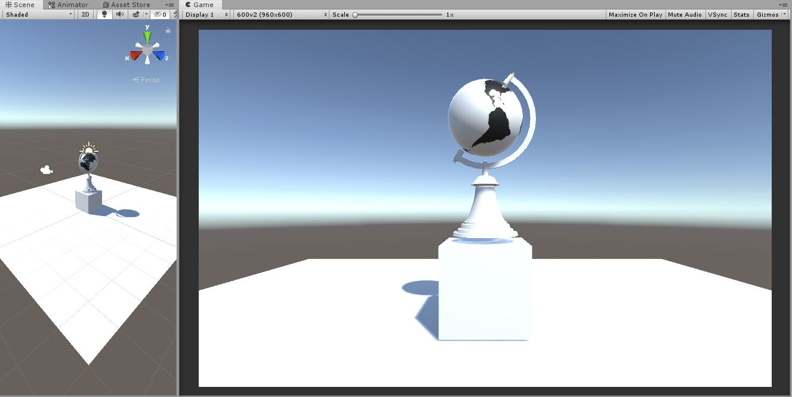
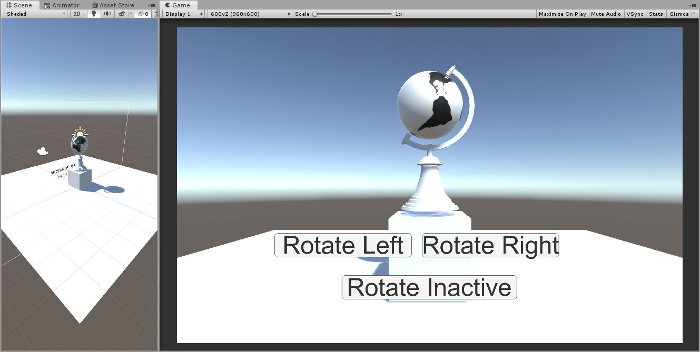

# smeerws-AnimatedGlobe

### Project description: 
This project serves to demonstrate the usage of *Animations* in combination with the *Animator* and *C# scripts*. 

The game includes 2 branches.

### Development platform: 
Windows 10; 
Unity Version: 2019.1.14f1; 
Visual Studio Version: Microsoft Visual Studio Community 2017, Version 15.9.17;
Scripting Runtime Version: 4.X;

### Target platform: 
Standalone, Oculus Rift no reference resolution 

### Visuals: 
branch master

branch interactionButtons

### Necessary setup/execution steps: 
Installation process, e.g. step by step instructions that I can run the project after cloning it

* show all branches: git branch -a
* switch between branches from master to interactionButtons (only the first time), creates a local branch interactionButtons in the way that this branch represents the remote branch origin/interactionButtons: git checkout -b interactionButtons origin/interactionButtons
* switch between local braches: git chechout branchname 
* show repo url: git remote -v

### Third party material: 
(if used Fonts, Sounds, Music, Graphics, Materials, Code etc.)

* Tutorial https://youtu.be/gON_hhhvheI
* Git usage: https://git-scm.com/book/en/v2/Git-Basics-Working-with-Remotes

### Project state: 
100%

### Limitations: None

### Lessons Learned: 
* Useing Animator, Animations in combination with C# scripts
* Switching between branches

Copyright by smeerws
